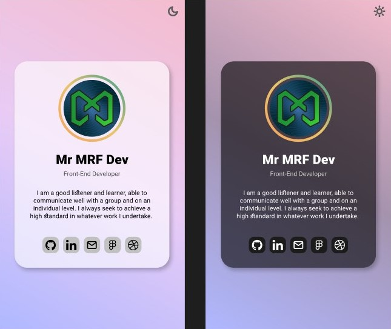

# 📇 Simple Profile Card

This project is a single-page website that allows you to create a simple and elegant profile card to share with others. It's a fun experiment where I used Figma to design the website and then converted it to HTML and CSS.



## 🚀 Demos

Check out the live demo [here](https://mr-mrf-dev.github.io/Simple-Profile-Card/).

## 🎨 Design

The design was created using [Figma](https://www.figma.com/community/file/1400963728182549076/simple-profile-card). Feel free to take a look!

## 📥 Getting Started

1. Clone the Repository

    If you have [Git](https://git-scm.com/) installed:

    ```bash
    git clone https://github.com/Mr-MRF-Dev/Simple-Profile-Card.git
    ```

    If you have [GitHub CLI](https://cli.github.com/) installed:

    ```bash
    gh repo clone Mr-MRF-Dev/Simple-Profile-Card
    ```

2. Navigate to the Project Directory

    ```bash
    cd ./Simple-Profile-Card
    ```

3. Open the folder in your code editor (like [VSCode](https://code.visualstudio.com/))

    ```bash
    code .
    ```

4. Open the `index.html` file in your browser

    You can use the [Live Server](https://marketplace.visualstudio.com/items?itemName=ritwickdey.LiveServer) extension in VSCode.
    Alternatively, you can do this by right-clicking on the file and selecting `Open with` and then selecting your browser.

## 🤝 Contributing

We welcome any contributions you may have. If you're interested in helping out, please fork the repository and create an [Issue](https://github.com/Mr-MRF-Dev/Simple-Profile-Card/issues) or [Pull Request](https://github.com/Mr-MRF-Dev/Simple-Profile-Card/pulls).

## 📝 License

This project is licensed under the MIT License. See the [LICENSE.md](LICENSE.md) file for details.
